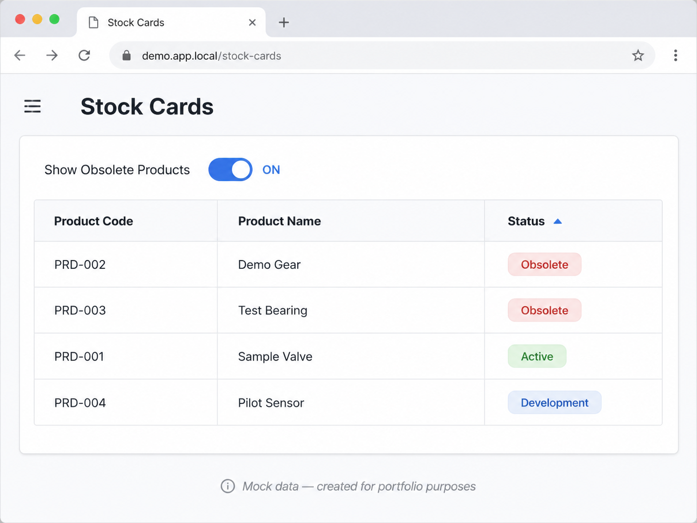

# TC-002 — Show Obsolete Products

## Test Objective
Verify that the **Show Obsolete Products** option on the **Stock Cards** page meets the defined requirement.

## Preconditions
1. The user is logged in with an authorized account.
2. The user has access to **Products > Stock Cards**.
3. At least one active and one obsolete stock card exist in the system.
4. The **Show Obsolete Products** option is disabled by default.

## Test Steps
1. Open the **Stock Cards** page.
2. Verify that obsolete products are not displayed by default.
3. Enable the **Show Obsolete Products** option.
4. Verify that products with the status **Obsolete** are displayed.
5. Verify that the **Status** column automatically switches to sorting mode.
6. Verify that obsolete products are displayed at the top of the list.
7. Change the sorting direction of the **Status** column.
8. Observe the order of obsolete products after the sorting direction is changed.

## Expected Result
When the **Show Obsolete Products** option is enabled:

- Obsolete products should become visible.
- The **Status** column should automatically enter sorting mode.
- Obsolete products should be displayed at the top of the list.

## Actual Result
The obsolete products became visible after the option was enabled. The system automatically applied sorting to the **Status** column and displayed obsolete products at the top of the list.

After the sorting direction was changed manually, obsolete products were ordered according to the system's internal sorting logic rather than an obvious secondary criterion such as product name or ID.

## Test Result
**PASS**

## Additional Observation
The secondary sorting rule used for obsolete products is not clear to the user. If a secondary sorting criterion is defined in the requirement, it should be verified separately. Otherwise, this behavior may be documented as a usability or requirement-clarity improvement.

## Evidence
Sanitized mockup created for portfolio purposes:

## Given–When–Then
**Given** obsolete products are hidden from the list by default,  
**When** the user enables the **Show Obsolete Products** option,  
**Then** obsolete products are added to the list and displayed at the top.
